## Creacion del repositorio Repo01 

#### Pasos realizados:

1. Primero el repositorio 'Repo01' ha sido creado en local accediendo desde el terminal de git bash a la carpeta indicada y ejecutando el comando 'git init'.
2. Para comprobar que el repositorio se ha inicializado correctamente, se ejecuta en el mismo terminal de git el comando 'git status'.
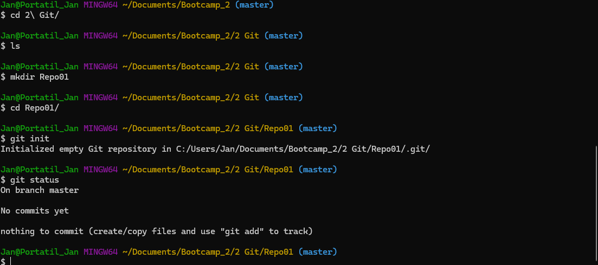
3. Se ha agregado en el repositorio el documento readme.md con el que se está trabajando en este momento.
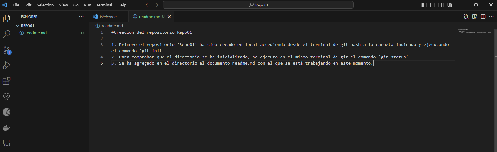
4. Se ha agregado este fichero readme.md al área de Staging con el comando 'git add readme.md' y se ha agregado al repositorio local con el comando 'git commit -m "Primera snapshot ejercicio1'.
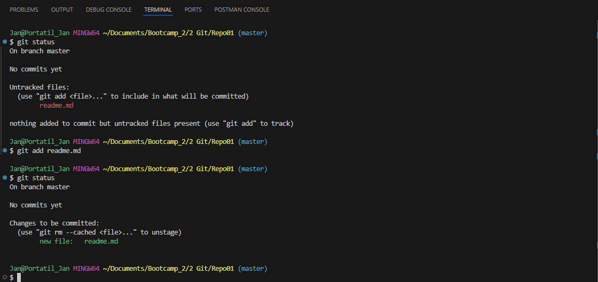
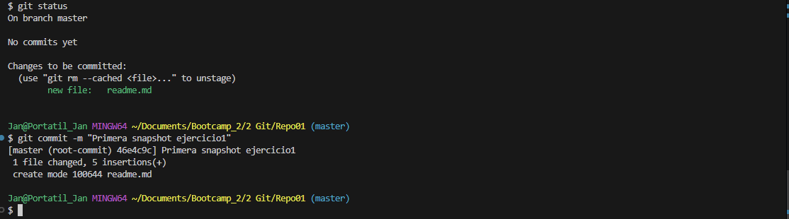
5. Se ha intentado subir el repositorio local al repositorio remoto mediante el comando "git push", pero al no haberse creado en Github ha retornado un error.
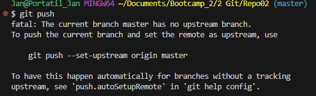
6. Se ha ejecutado el comando 'git remote -v' y no ha retornado nada por la línea de git bash. Lo que confirma la explicación anterior.
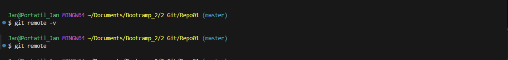
7. Un repositorio remoto llamado 'Repo01' ha sido creado en la página de Github y asociado a este repositorio local con el comando 'git remote add origin https://github.com/jancossio/Repo01.git'.
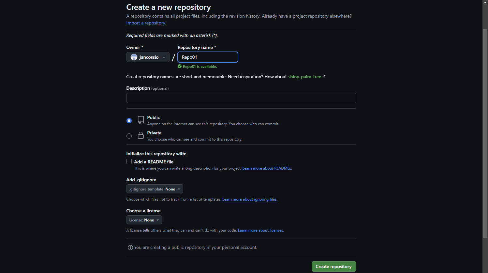
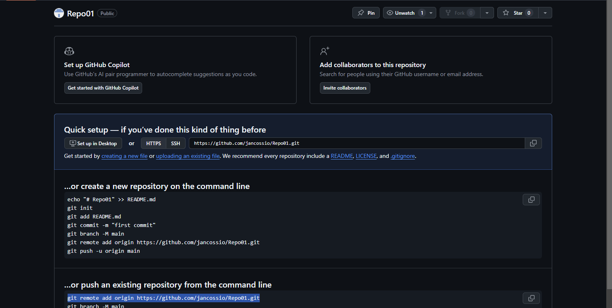
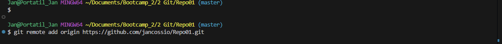
8. Se ejecuta el comando 'git remote -v' una vez más y se confirma que ahora está asociado a un repositorio remoto al aparecer estas líneas por el terminal: 'origin  https://github.com/jancossio/Repo01.git (fetch)
                        origin  https://github.com/jancossio/Repo01.git (push)'.
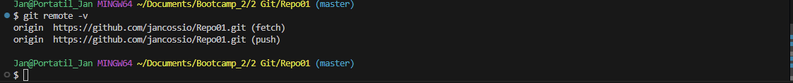
9. Una vez el problema anterior ya ha sido solucionado, podemos proceder a enviar el los cambios realizados en el repositorio local mediante el comando 'git push'. En este paso nos aparece un último error indicando que, a pesar de que el repositorio remoto ha sido creado y enlazado con el  local, no existe una rama en el remoto que quede asociada con la rama 'main' local que permita subirlo. Para solucionarlo, se ha ejecutado el comando 'git push --set-upstream origin main' en local (con el que se ordena al repositorio remoto que cree una rama main para elazarla con su respectiva local). Una vez este paso ha sido completado, se puede comprobar como el contenido ha sido enviado correctamente al volver a ejecutar 'git push' y recibir un mensaje en el que se indica que todo está actualizado, como se muestra más abajo.
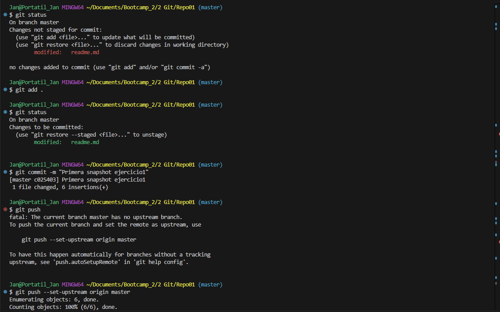
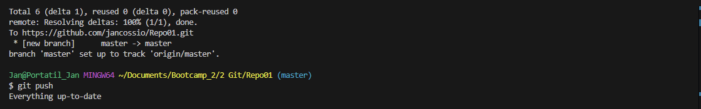
10. Finalmente, nos dirigimos al repositorio remoto para comprobar que los cambios se han guardado correctamente. Una vez ahí se verifica que la edición realizada sobre el documento de readme.md en el repositorio local ha sido guardado correctamente en remoto. 
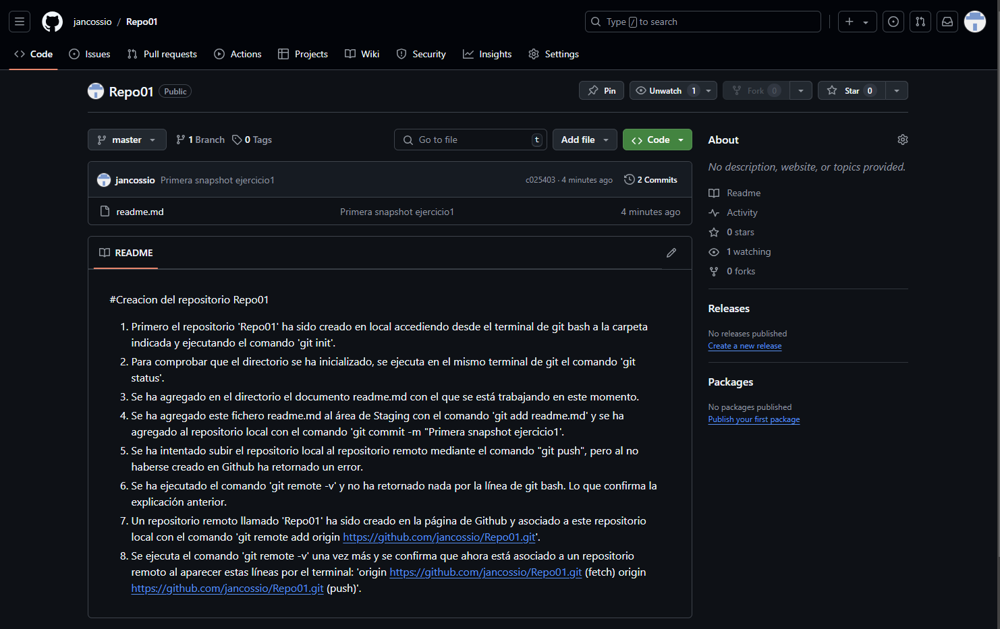

## Creacion del repositorio Repo01 

#### Pasos realizados:

1. Primero el repositorio 'Repo01' ha sido creado en local accediendo desde el terminal de git bash a la carpeta indicada y ejecutando el comando 'git init'.
2. Para comprobar que el repositorio se ha inicializado correctamente, se ejecuta en el mismo terminal de git el comando 'git status'.

3. Se ha agregado en el repositorio el documento readme.md con el que se está trabajando en este momento.

4. Se ha agregado este fichero readme.md al área de Staging con el comando 'git add readme.md' y se ha agregado al repositorio local con el comando 'git commit -m "Primera snapshot ejercicio1'.

5. Se ha intentado subir el repositorio local al repositorio remoto mediante el comando "git push", pero al no haberse creado en Github ha retornado un error.

6. Se ha ejecutado el comando 'git remote -v' y no ha retornado nada por la línea de git bash. Lo que confirma la explicación anterior.

7. Un repositorio remoto llamado 'Repo01' ha sido creado en la página de Github y asociado a este repositorio local con el comando 'git remote add origin https://github.com/jancossio/Repo01.git'.

8. Se ejecuta el comando 'git remote -v' una vez más y se confirma que ahora está asociado a un repositorio remoto al aparecer estas líneas por el terminal: 'origin  https://github.com/jancossio/Repo01.git (fetch)
                        origin  https://github.com/jancossio/Repo01.git (push)'.

9. Una vez el problema anterior ya ha sido solucionado, podemos proceder a enviar el los cambios realizados en el repositorio local mediante el comando 'git push'. En este paso nos aparece un último error indicando que, a pesar de que el repositorio remoto ha sido creado y enlazado con el  local, no existe una rama en el remoto que quede asociada con la rama 'main' local que permita subirlo. Para solucionarlo, se ha ejecutado el comando 'git push --set-upstream origin main' en local (con el que se ordena al repositorio remoto que cree una rama main para elazarla con su respectiva local). Una vez este paso ha sido completado, se puede comprobar como el contenido ha sido enviado correctamente al volver a ejecutar 'git push' y recibir un mensaje en el que se indica que todo está actualizado, como se muestra más abajo.

10. Finalmente, nos dirigimos al repositorio remoto para comprobar que los cambios se han guardado correctamente. Una vez ahí se verifica que la edición realizada sobre el documento de readme.md en el repositorio local ha sido guardado correctamente en remoto. 

